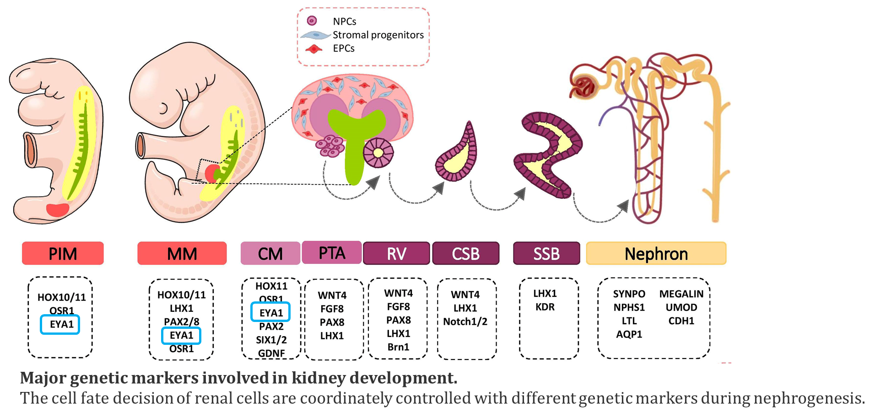

# The transcriptional coactivator Eya1 exerts transcriptional repressive activity by interacting with REST corepressors and DNA recognition sequences to maintain nephron progenitor identity

EYA Transcriptional Coactivator And Phosphatase 1 (Eya1) plays an important role in maintaining nephron progenitor cells (NPCs) but it has no intrinsic DNA-binding activity. Some research reported that EYA1 protein interacts with SIX2 protein to regulate gene expression and cell proliferation that is critical for controlling NPCs Maintenance. However, the mechanism of the Eya1 network to mediate cell proliferation and maintain the NPCs identity is poorly understood.

In order to identify genes which are associated with Eya1 in NPCs, the researchers performed RNA-seq experiments. First, they used FACS to isolate tdTomato+ cells from control (Eya1CreER/+;tdTomato) and Eya1cKO (Eya1CreER/+;Eya1fl/fl;R26-Tdtomato) kidneys of mice embryo at E12.5~E12.75. Second, mRNA was purified from total RNA using magnetic beads. Third, RNA-seq libraries were prepared and sequenced using Illumina NextSeq 500 with single-end 75-bp. Lastly, mapping reads to mouse genome mm10 and analyzing differential expression and functional annotation.

GEO data source [https://www.ncbi.nlm.nih.gov/geo/query/acc.cgi?acc=GSE202956](https://www.ncbi.nlm.nih.gov/geo/query/acc.cgi?acc=GSE202956)

Reference adapt from: Cellular and Molecular Mechanisms of Kidney Development: From the Embryo to the Kidney Organoid. Niloofar Khoshdel Rad,Nasser Aghdami, and Reza Moghadasali. Front Cell Dev Biol. 2020; 8: 183. doi: 10.3389/fcell.2020.00183
[https://www.ncbi.nlm.nih.gov/pmc/articles/PMC7105577/](https://www.ncbi.nlm.nih.gov/pmc/articles/PMC7105577/)
